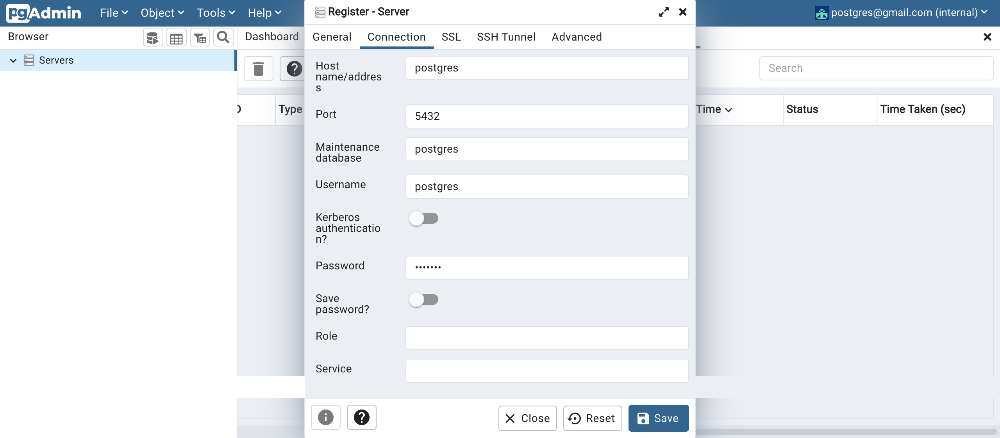
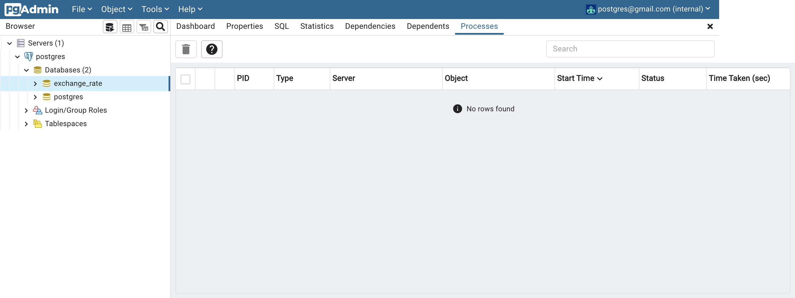

<!-- # currency_api -->

This project is intended for practicing and being built based on typescript, postgres and express.
You can get daily rate of the MMK per USD.

## Prequisites
- [node](https://nodejs.org/en/)
- [git](https://git-scm.com/)
- [Docker](https://www.docker.com/)
### How to start the project:

- First, you clone the project by following command:
  `https://github.com/AungKOO/currency_api.git`
- Install node version 18.9.0^ or use nvm to upgrade your node version.
- Install [Docker](https://www.docker.com/)
- Run your docker app
- open the project folder (`currency_api/`) in your code editor
- RUN the following command:
  - `npm i` to get the packages
  - `npm run prod-build` to build the production
  - `docker-compose build` to build the docker image
  - `docker-compose up -d` to run services and containers
- After running the services and containers, run the following command for data seeding:
  - `docker-compose exec backend node migrations/migration.js`
- Enter the pgAdmin to check the connection for database:
  - `localhost:4000`
  - username and password will be in pgadmin service in docker-compose file for login
  - then register database server
    - hostname/address will be postgres and password will be in docker-compose(in postgres service) file.
  - open the exchage_rate database connection
  - 
  - 
  - 

## Usage

### daily rate

<https://localhost:8000/api/v1/day/today.json>

#### monthly rate

format: <https://localhost:8000/api/v1/month/{yyyymm}.json>

<https://localhost:8000/api/v1/month/202202.json>

#### rate for specific date

format: <https://localhost:8000/api/v1/date/{yyyymmdd}.json>

<https://localhost:8000/api/v1/date/20221101.json>

## JSON_format

Specific date or today အတွက် JSON format:

```javascript
{
    "type": "success",
    "data": [
        {
            "date": "2022-12-11T06:12:40.991Z",
            "currency": [
                    {
                        "rate": 2935,
                        "currency_format": "USD"
                    }
                ]
        }
    ]
}
```

month အတွက် JSON format:

```javascript
{
    "type": "success",
    "data": [
        {
            "date": "2022-10-01T04:12:40.991Z",
            "currency": [
                    {
                        "rate": 2900,
                        "currency_format": "USD"
                    }
                ]

        },
        {
            "date": "2022-10-02T04:12:40.991Z",
            "currency": [
                    {
                        "rate": 2895,
                        "currency_format": "USD"
                    }
                ]

        },
        ...
        {
            "date": "2022-10-29T04:12:40.991Z",
            "currency": [
                    {
                        "rate": 2915,
                        "currency_format": "USD"
                    }
                ]

        },
        {
            "date": "2022-10-30T04:12:40.991Z",
            "currency": [
                    {
                        "rate": 2917,
                        "currency_format": "USD"
                    }
                ]
            }
    ]
}
```

if there is no data in Database:
server will return `{type: "no data", data:[]}`

if there is an invalid request from client,
server will return **Bad Request** `400`
